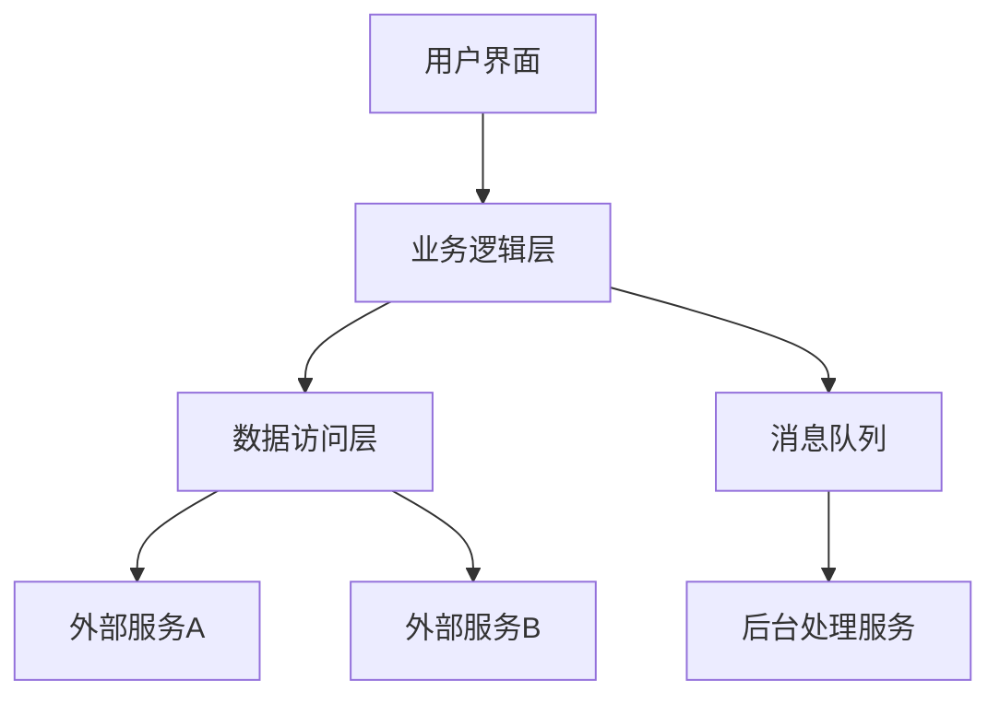

# API重构契约文档 (API Refactoring Contracts)

**项目名称**: [项目名称]  
**重构目标**: [重构目标]  
**源系统路径**: [源代码路径]  
**提取日期**: [日期]  
**分析范围**: [源系统模块/功能范围]

---

## 1. 现有系统接口分析 (Current System Interface Analysis)

**宪法要求**: Constitution II - Interface Stability (NON-NEGOTIABLE) + Constitution VI-E - Direct Replacement Refactoring

### 1.1 外部依赖识别

| 依赖类型 | 服务名称 | 接口协议 | 调用方式 | 关键等级 | 重构影响 |
|----------|----------|----------|----------|----------|----------|
| HTTP API | [service_name] | REST/GraphQL | sync/async | P0/P1/P2 | [影响描述] |
| 消息队列 | [queue_name] | AMQP/Kafka | producer/consumer | P0/P1/P2 | [影响描述] |
| 数据库 | [db_name] | SQL/NoSQL | direct/ORM | P0/P1/P2 | [影响描述] |
| 文件系统 | [storage_path] | local/cloud | read/write | P0/P1/P2 | [影响描述] |
| 第三方SDK | [sdk_name] | library/api | direct call | P0/P1/P2 | [影响描述] |

### 1.2 接口调用拓扑

#### 调用关系图


#### 关键调用路径
1. **主要路径**: [路径描述]
   - 调用链: [调用序列]
   - 数据流: [数据流向]
   - 性能要求: [响应时间/吞吐量]

2. **次要路径**: [路径描述]
   - 调用链: [调用序列]
   - 数据流: [数据流向]
   - 性能要求: [响应时间/吞吐量]

---

## 2. 数据契约提取 (Data Contract Extraction)

### 2.1 业务实体映射

#### 实体: [EntityName]
**源定义位置**: [file_path]:[line_number]  
**变更频率**: [高/中/低]  
**数据敏感度**: [高/中/低]

```javascript
// 源系统中的实际定义
interface [EntityName] {
  [field_name]: [field_type];  // [业务含义 + 约束条件]
  [field_name]: [field_type];  // [业务含义 + 约束条件]
  // ... 其他字段
}
```

**数据流转路径**:
- **创建**: [创建场景和流程]
- **读取**: [读取场景和频率]  
- **更新**: [更新场景和条件]
- **删除**: [删除场景和限制]

### 2.2 API数据格式规范

#### API: [api_endpoint]
**方法**: [GET/POST/PUT/DELETE]  
**用途**: [功能描述]

**请求格式**:
```javascript
{
  "[field_name]": [type],  // [描述 + 验证规则]
  "[field_name]": [type]   // [描述 + 验证规则]
}
```

**响应格式**:
```javascript
{
  "success": boolean,
  "data": {
    "[field_name]": [type],  // [描述]
    "[field_name]": [type]   // [描述]
  },
  "message": string,
  "timestamp": string
}
```

### 2.3 错误处理契约

| 错误码 | HTTP状态 | 错误描述 | 触发条件 | 重构要求 |
|--------|----------|----------|----------|----------|
| [ERROR_CODE] | [status] | [description] | [condition] | [保持/优化] |
| [ERROR_CODE] | [status] | [description] | [condition] | [保持/优化] |

---

## 3. 业务逻辑契约 (Business Logic Contracts)

### 3.1 核心业务规则

#### 规则: [RuleName]
**规则ID**: BR-[number]  
**源位置**: [file_path]:[line_number]  
**业务价值**: [业务价值描述]

**规则定义**: [详细的业务规则描述]

**执行条件**: [规则执行的前置条件]

**处理逻辑**: 
```
IF [condition] THEN [action]
ELSE IF [condition] THEN [action]
ELSE [default_action]
```

**重构要求**: 
- [ ] 必须保持逻辑完全一致
- [ ] 可优化实现方式
- [ ] 可优化性能

### 3.2 状态机契约

#### 状态机: [StateMachineName]
**业务场景**: [状态机解决的问题]

**状态定义**:
| 状态 | 描述 | 进入条件 | 退出条件 |
|------|------|----------|----------|
| [state] | [description] | [entry_condition] | [exit_condition] |

**状态转换**:
| 源状态 | 目标状态 | 触发事件 | 转换动作 | 守卫条件 |
|--------|----------|----------|----------|----------|
| [from] | [to] | [event] | [action] | [guard] |

### 3.3 计算逻辑契约

#### 计算: [CalculationName]
**计算ID**: CALC-[number]  
**源位置**: [file_path]:[line_number]

**输入参数**:
| 参数名 | 类型 | 必需 | 默认值 | 验证规则 |
|--------|------|------|--------|----------|
| [param] | [type] | [yes/no] | [default] | [validation] |

**计算公式**: [详细的计算逻辑或算法]

**输出结果**:
| 结果名 | 类型 | 精度要求 | 取值范围 |
|--------|------|----------|----------|
| [result] | [type] | [high/medium/low] | [range] |

**性能要求**: [响应时间要求]

---

## 4. 重构约束条件 (Refactoring Constraints)

### 4.1 不可变更的契约 (Constitution Compliance)

#### 接口稳定性 - Constitution II (NON-NEGOTIABLE)
- [ ] **API端点**: 所有HTTP端点路径和方法必须100%保持
- [ ] **请求格式**: 请求参数名称、类型、结构必须完全一致
- [ ] **响应格式**: 响应数据结构、字段名称、类型必须保持
- [ ] **错误处理**: 错误码、错误消息、HTTP状态码必须保持一致

#### 数据契约完整性 - Constitution III + VI-D
- [ ] **实体结构**: 业务实体的属性、类型、约束必须保持
- [ ] **关系映射**: 实体间的关系和约束必须保持
- [ ] **验证规则**: 数据验证逻辑和错误提示必须保持
- [ ] **默认值**: 字段默认值和初始化逻辑必须保持

#### 行为保持 - Constitution I (NON-NEGOTIABLE)
- [ ] **业务规则**: 核心业务规则的计算逻辑必须保持
- [ ] **状态转换**: 状态机的转换逻辑必须保持
- [ ] **权限控制**: 权限检查和控制逻辑必须保持
- [ ] **事务处理**: 事务边界和回滚逻辑必须保持

#### 数据真实性 - Constitution VI-C (NON-NEGOTIABLE)
- [ ] **真实数据**: 严禁使用假数据，必须调用真实API
- [ ] **生产就绪**: 数据源必须是生产级别的，不是开发测试数据
- [ ] **数据验证**: 必须验证所有数据的真实性和来源可靠性

### 4.2 允许优化的范围

#### 实现层面
- [x] **代码结构**: 可以优化代码组织和模块划分
- [x] **算法优化**: 可以优化算法性能（不改变结果）
- [x] **内存管理**: 可以优化内存使用和垃圾回收
- [x] **并发处理**: 可以优化并发和异步处理

#### 非功能性
- [x] **性能优化**: 提升响应速度和吞吐量
- [x] **可扩展性**: 增强系统的可扩展能力
- [x] **可维护性**: 改善代码的可读性和可维护性
- [x] **监控能力**: 增强监控和可观测性

---

## 5. 验证策略 (Verification Strategy)

### 5.1 契约验证方法

#### API兼容性验证
```bash
# 验证脚本示例
#!/bin/bash
# 1. 端点对比验证
compare_api_endpoints old_system new_system

# 2. 请求响应格式验证  
validate_request_response_format old_api new_api

# 3. 错误处理一致性验证
validate_error_handling old_system new_system
```

#### 数据一致性验证
```bash
# 1. 数据结构对比
compare_data_structures old_schema new_schema

# 2. 数据验证规则验证
validate_validation_rules old_system new_system

# 3. 实体关系验证
validate_entity_relationships old_model new_model
```

### 5.2 测试用例映射

#### 关键功能测试
| 测试ID | 功能描述 | 测试数据 | 预期结果 | 验证方法 | 优先级 |
|--------|----------|----------|----------|----------|--------|
| TC-API-001 | [功能描述] | [测试数据] | [预期结果] | [自动化/手动] | P0 |
| TC-API-002 | [功能描述] | [测试数据] | [预期结果] | [自动化/手动] | P1 |

#### 边界条件测试
| 测试ID | 边界条件 | 测试数据 | 预期结果 | 重构风险 | 优先级 |
|--------|----------|----------|----------|----------|--------|
| TC-Boundary-001 | [边界描述] | [边界值] | [预期行为] | [风险等级] | P0 |
| TC-Boundary-002 | [边界描述] | [边界值] | [预期行为] | [风险等级] | P1 |

### 5.3 性能基准验证

| 性能指标 | 原系统基准 | 目标要求 | 测试方法 | 验证频率 |
|----------|------------|----------|----------|----------|
| 响应时间 | [baseline]ms | ≤[target]ms | 压力测试 | 每次发布 |
| 并发用户 | [baseline] | ≥[target] | 负载测试 | 每次发布 |
| 错误率 | [baseline]% | ≤[target]% | 稳定性测试 | 每次发布 |
| 资源占用 | [baseline] | ≤[target] | 性能监控 | 持续监控 |

---

## 6. 风险控制与回滚策略 (Risk Control & Rollback)

### 6.1 高风险变更识别

| 变更类别 | 风险描述 | 影响范围 | 风险等级 | 缓解措施 |
|----------|----------|----------|----------|----------|
| API变更 | [风险描述] | [影响模块] | [高/中/低] | [缓解方案] |
| 数据结构变更 | [风险描述] | [影响模块] | [高/中/低] | [缓解方案] |
| 业务逻辑变更 | [风险描述] | [影响模块] | [高/中/低] | [缓解方案] |

### 6.2 渐进式发布策略

#### 阶段1: 影子测试
- **目标**: 验证新系统的正确性
- **策略**: 新系统与旧系统并行运行，对比结果
- **退出条件**: 连续[X]小时无差异
- **回滚方案**: 停止新系统，保持旧系统

#### 阶段2: 流量切换
- **目标**: 逐步将流量切换到新系统
- **策略**: [1% → 10% → 50% → 100%]
- **监控指标**: 错误率、响应时间、业务指标
- **回滚方案**: 立即切换回旧系统

#### 阶段3: 稳定运行
- **目标**: 确保新系统稳定运行
- **策略**: 全流量运行[X]天
- **监控**: 24/7监控和告警
- **回滚方案**: 紧急回滚到旧系统

### 6.3 回滚执行计划

#### 回滚触发条件
- [ ] 错误率超过 [阈值] 持续 [时间]
- [ ] 响应时间超过 [阈值] 持续 [时间]
- [ ] 业务指标异常（如订单量下降 [百分比]%）
- [ ] 数据不一致或丢失
- [ ] 第三方依赖异常

#### 回滚步骤
```bash
#!/bin/bash
# 1. 停止新系统
stop_new_system

# 2. 数据回滚（如果需要）
rollback_data_changes

# 3. 恢复旧系统
restore_old_system

# 4. 验证系统状态
verify_system_health

# 5. 通知相关人员
notify_stakeholders "系统已回滚"
```

---

## 7. 合规检查清单 (Compliance Checklist)

### 7.1 重构前检查
- [ ] 所有API契约已完整提取和文档化
- [ ] 所有业务规则已识别和验证
- [ ] 数据结构映射已完成
- [ ] 风险评估已完成
- [ ] 回滚方案已准备就绪
- [ ] 测试用例已准备完成

### 7.2 重构中检查
- [ ] 接口实现与契约100%一致
- [ ] 业务逻辑保持完全一致
- [ ] 数据验证规则保持不变
- [ ] 错误处理机制保持一致
- [ ] 性能指标满足要求
- [ ] 安全控制措施保持有效

### 7.3 重构后验证
- [ ] 所有测试用例通过
- [ ] 性能指标达到基准要求
- [ ] 业务指标正常
- [ ] 监控告警正常工作
- [ ] 回滚方案经过测试
- [ ] 文档已更新

---

**文档状态**: [草稿/评审通过/已验证]  
**合规等级**: [A/B/C]  
**风险评估**: [低/中/高]  
**最后更新**: [更新日期]  
**更新人**: [更新者]  
**审核人**: [审核者]  
**批准人**: [批准者]

---

*本重构契约文档是系统重构的核心法律文档，明确定义了重构的边界条件和验收标准。任何偏离本契约的修改都需要经过严格的变更控制流程和风险评估。*

---

**附件**: 
- [接口调用详细日志]
- [数据结构映射表]  
- [测试用例完整列表]
- [性能基准测试报告]
- [风险评估详细报告]