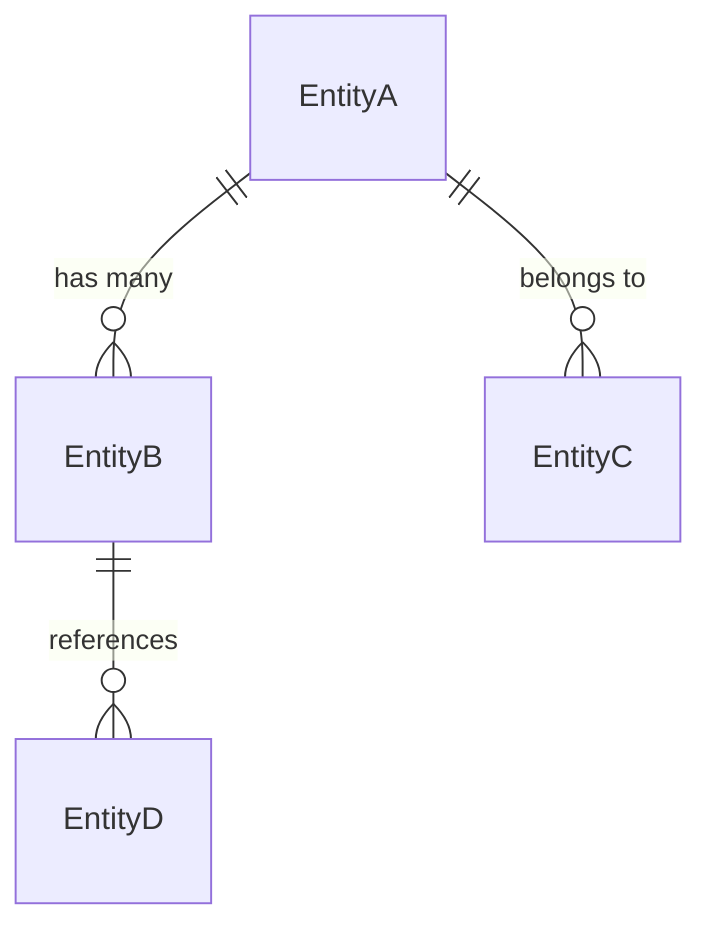

# API契约文档 (API Contracts)

**项目名称**: [项目名称]  
**重构目标**: [重构目标]  
**源系统路径**: [源代码路径]  
**提取日期**: [日期]  
**分析范围**: [分析范围描述]

---

## 1. 外部接口契约 (External Interface Contracts)

### 1.1 HTTP API端点

| 方法 | 端点 | 功能描述 | 认证要求 | 调用频次 | 关键性 |
|------|------|----------|----------|----------|--------|
| [GET/POST/PUT/DELETE] | [endpoint] | [功能描述] | [Required/Optional] | [高/中/低] | [P0/P1/P2] |
| [GET/POST/PUT/DELETE] | [endpoint] | [功能描述] | [Required/Optional] | [高/中/低] | [P0/P1/P2] |

#### API调用序列分析
**业务流程**: [流程名称]
```
1. [API_CALL_1] → [目的]
   ↓
2. [API_CALL_2] → [目的]  
   ↓
3. [API_CALL_3] → [目的]
```

**数据流向**: [数据在API间的流转描述]

### 1.2 第三方服务集成

| 服务提供商 | 服务类型 | 接口方式 | 用途说明 | 依赖程度 |
|------------|----------|----------|----------|----------|
| [如：支付网关] | [如：支付服务] | [如：REST/SDK] | [具体用途] | [强/弱依赖] |
| [如：云存储] | [如：文件服务] | [如：REST/SDK] | [具体用途] | [强/弱依赖] |

### 1.3 消息队列/事件总线

| 事件名称 | 发布者 | 订阅者 | 数据格式 | 触发条件 |
|----------|--------|--------|----------|----------|
| [event_name] | [publisher] | [subscriber] | [data_format] | [trigger_condition] |

---

## 2. 数据结构契约 (Data Structure Contracts)

### 2.1 核心业务实体

#### 实体: [EntityName]
```javascript
// 源代码中的实际定义
interface [EntityName] {
  [field_name]: [field_type];  // [字段描述和约束]
  [field_name]: [field_type];  // [字段描述和约束]
}
```
**业务含义**: [实体在业务中的作用]  
**数据来源**: [数据来源说明]  
**数据去向**: [数据使用场景]  
**变更频率**: [高/中/低]  
**数据量级**: [大/中/小]

### 2.2 数据传输对象 (DTO)

#### [DtoName]
```javascript
interface [DtoName] {
  [field_name]: [field_type];  // [字段描述]
  [field_name]: [field_type];  // [字段描述]
}
```
**使用场景**: [在哪个API调用中使用]  
**验证规则**: [数据验证要求]  
**转换逻辑**: [与其他实体的转换关系]

### 2.3 数据关系映射

#### 实体关系图


#### 关键约束
- **唯一性约束**: [约束描述]
- **外键约束**: [约束描述]  
- **业务规则**: [约束描述]

---

## 3. 业务逻辑契约 (Business Logic Contracts)

### 3.1 核心业务规则

| 规则ID | 规则描述 | 适用场景 | 实现位置 | 重构要求 |
|--------|----------|----------|----------|----------|
| BR-001 | [具体的业务规则描述] | [适用场景] | [源文件位置] | [保持/优化] |
| BR-002 | [具体的业务规则描述] | [适用场景] | [源文件位置] | [保持/优化] |

### 3.2 计算逻辑

| 计算项 | 计算公式 | 输入参数 | 输出结果 | 精度要求 |
|--------|----------|----------|----------|----------|
| [计算名称] | [公式或算法] | [参数列表] | [结果类型] | [高/中/低] |

### 3.3 状态机定义

#### 状态: [状态机名称]
**状态类型**: [业务状态/系统状态]  
**初始状态**: [初始状态]  
**状态转换**:
| 当前状态 | 触发条件 | 目标状态 | 动作 |
|----------|----------|----------|------|
| [state_a] | [condition] | [state_b] | [action] |
| [state_b] | [condition] | [state_c] | [action] |

---

## 4. 用户界面契约 (User Interface Contracts)

### 4.1 用户交互流程

#### 流程: [流程名称]
**用户目标**: [用户要完成的任务]  
**前置条件**: [执行前必须满足的条件]  
**步骤序列**:
1. **步骤1**: [操作描述] 
   - 用户操作: [具体动作]
   - 系统响应: [反馈内容]
   - 数据变化: [数据状态变更]
2. **步骤2**: [操作描述]
   - 用户操作: [具体动作]
   - 系统响应: [反馈内容]  
   - 数据变化: [数据状态变更]

### 4.2 界面组件契约

#### 组件: [ComponentName]
**功能职责**: [组件负责的功能]  
**数据输入**: [接收的数据和格式]  
**事件输出**: [产生的事件和数据]  
**显示规则**: [数据展示的逻辑]  
**交互约束**: [用户交互的限制条件]

### 4.3 数据验证规则

| 验证项 | 验证规则 | 错误提示 | 触发时机 |
|--------|----------|----------|----------|
| [字段名] | [验证逻辑] | [错误消息] | [触发条件] |

---

## 5. 重构合规性要求 (Refactoring Compliance Requirements)

### 5.1 接口稳定性要求

#### API兼容性
- [ ] **端点保持**: 所有HTTP端点路径和方法必须完全保持
- [ ] **参数结构**: 请求参数结构和名称必须保持一致  
- [ ] **响应格式**: 响应数据结构必须完全匹配
- [ ] **错误处理**: 错误码和错误信息必须保持一致

#### 数据兼容性
- [ ] **实体结构**: 业务实体的属性和类型必须保持
- [ ] **关系映射**: 实体间的关系必须保持一致
- [ ] **约束规则**: 数据验证规则必须保持
- [ ] **业务逻辑**: 核心业务规则必须完全保持

### 5.2 行为保持要求

#### 功能行为
- [ ] **输入输出**: 相同输入必须产生相同输出
- [ ] **边界处理**: 边界条件处理必须保持一致
- [ ] **异常处理**: 异常情况的处理逻辑必须保持
- [ ] **性能特征**: 响应时间不应劣于原系统

#### 用户体验
- [ ] **操作流程**: 用户操作步骤必须保持一致
- [ ] **反馈机制**: 系统反馈的方式和时机必须保持
- [ ] **状态可见**: 用户必须能清楚看到系统状态
- [ ] **错误恢复**: 错误恢复的路径必须保持

### 5.3 验证标准

| 验证类别 | 验证方法 | 验证工具 | 验证标准 |
|----------|----------|----------|----------|
| 接口兼容性 | 对比测试 | API测试工具 | 100%匹配 |
| 数据一致性 | 数据对比 | 数据校验脚本 | 完全一致 |
| 功能行为 | 端到端测试 | 自动化测试 | 行为一致 |
| 用户体验 | 用户验收 | 用户测试 | 无感知差异 |

---

## 6. 测试契约 (Testing Contracts)

### 6.1 关键测试场景

#### 接口测试
| 测试场景 | 请求参数 | 预期响应 | 测试数据 | 优先级 |
|----------|----------|----------|----------|--------|
| [正常场景] | [参数] | [预期结果] | [测试数据] | P0 |
| [异常场景] | [参数] | [预期结果] | [测试数据] | P1 |

#### 业务逻辑测试  
| 业务规则 | 测试数据 | 预期行为 | 验证方法 | 优先级 |
|----------|----------|----------|----------|--------|
| [规则描述] | [测试数据] | [预期结果] | [验证方式] | P0 |

### 6.2 性能基准

| 性能指标 | 原系统基准 | 目标系统要求 | 测试方法 |
|----------|------------|--------------|----------|
| [响应时间] | [基准值] | [要求值] | [测试方法] |
| [并发能力] | [基准值] | [要求值] | [测试方法] |
| [资源占用] | [基准值] | [要求值] | [测试方法] |

---

## 7. 风险控制 (Risk Control)

### 7.1 风险识别

| 风险类别 | 风险描述 | 影响程度 | 发生概率 | 缓解措施 |
|----------|----------|----------|----------|----------|
| [接口变更] | [风险描述] | [高/中/低] | [高/中/低] | [缓解方案] |
| [数据丢失] | [风险描述] | [高/中/低] | [高/中/低] | [缓解方案] |

### 7.2 回滚策略

#### 回滚触发条件
- [条件1]: [具体描述]
- [条件2]: [具体描述]

#### 回滚步骤
1. [步骤1]: [具体操作]
2. [步骤2]: [具体操作]  
3. [步骤3]: [具体操作]

---

**文档状态**: [草稿/评审通过/已验证]  
**合规等级**: [A/B/C]  
**最后更新**: [更新日期]  
**更新人**: [更新者]  
**审核人**: [审核者]

---

*本API契约文档是重构项目的核心法律文档，定义了新旧系统之间的接口契约和边界条件。任何偏离本契约的修改都需要经过严格的变更控制流程。*