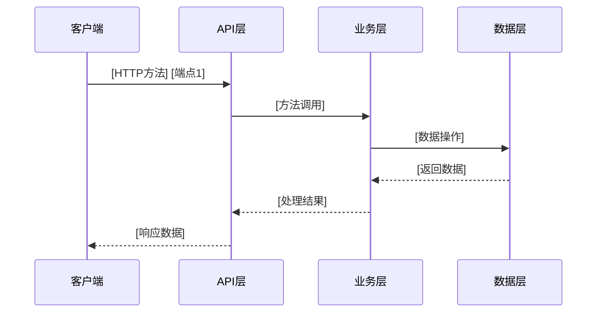
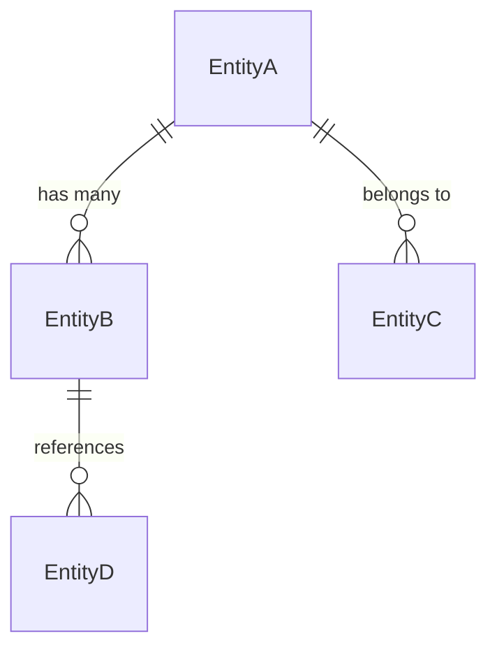

# API契约文档 (API Contracts)

**项目名称**: [项目名称]  
**重构目标**: [重构目标]  
**源系统路径**: [源代码路径]  
**提取日期**: [日期]  
**分析范围**: [分析范围描述]

---

## 1. 外部接口契约 (External Interface Contracts)

### 1.1 RESTful API 端点契约

#### 1.1.1 标准 RESTful 资源接口
| 资源名称 | HTTP方法 | 端点路径 | 功能描述 | 认证要求 | 关键性 | RESTful 约别 |
|----------|----------|----------|----------|----------|--------|--------------|
| [ResourceName] | GET | `/api/v1/[resource]` | 获取资源列表 | [Required/Optional] | [P0/P1/P2] | Collection |
| [ResourceName] | POST | `/api/v1/[resource]` | 创建新资源 | [Required/Optional] | [P0/P1/P2] | Collection |
| [ResourceName] | GET | `/api/v1/[resource]/{id}` | 获取单个资源 | [Required/Optional] | [P0/P1/P2] | Entity |
| [ResourceName] | PUT | `/api/v1/[resource]/{id}` | 更新资源 | [Required/Optional] | [P0/P1/P2] | Entity |
| [ResourceName] | DELETE | `/api/v1/[resource]/{id}` | 删除资源 | [Required/Optional] | [P0/P1/P2] | Entity |

#### 1.1.2 业务逻辑接口
| 接口名称 | HTTP方法 | 端点路径 | 功能描述 | 认证要求 | 关键性 | 接口类型 |
|----------|----------|----------|----------|----------|--------|----------|
| [InterfaceName] | [POST/GET] | `/api/v1/[business-action]` | [功能描述] | [Required/Optional] | [P0/P1/P2] | [Action/Query] |

#### 1.1.3 API 契约详细定义
**资源**: [ResourceName]
```typescript
// 请求接口
interface [RequestInterface] {
  [field_name]: [field_type];  // [字段描述和约束]
  [field_name]: [field_type];  // [字段描述和约束]
}

// 响应接口  
interface [ResponseInterface] {
  [field_name]: [field_type];  // [字段描述和约束]
  [field_name]: [field_type];  // [字段描述和约束]
}
```

**RESTful 约别说明**:
- **Collection**: 操作资源集合的接口
- **Entity**: 操作单个资源的接口
- **Action**: 执行业务操作的接口
- **Query**: 执行查询操作的接口

### 1.2 API 调用序列分析

#### 业务流程: [流程名称]


**数据流向**: [数据在API间的流转描述]
**调用频率**: [高/中/低]
**性能要求**: [响应时间要求]

### 1.3 第三方服务集成

| 服务提供商 | 服务类型 | 接口方式 | 用途说明 | 依赖程度 | SLA要求 |
|------------|----------|----------|----------|----------|---------|
| [如：支付网关] | [如：支付服务] | [如：REST/SDK] | [具体用途] | [强/弱依赖] | [可用性要求] |
| [如：云存储] | [如：文件服务] | [如：REST/SDK] | [具体用途] | [强/弱依赖] | [可用性要求] |

### 1.4 消息队列/事件总线

| 事件名称 | 发布者 | 订阅者 | 数据格式 | 触发条件 |
|----------|--------|--------|----------|----------|
| [event_name] | [publisher] | [subscriber] | [data_format] | [trigger_condition] |

---

## 2. Repository 模式契约 (Repository Pattern Contracts)

### 2.1 Repository 模式架构要求

#### 2.1.1 核心 Repository 接口定义
```typescript
// 基础 Repository 接口
interface IRepository<T> {
  // 源函数名及签名
  findById(id: string | number): Promise<T | null>;
  findAll(params?: QueryParams): Promise<T[]>;
  create(data: Omit<T, 'id'>): Promise<T>;
  update(id: string | number, data: Partial<T>): Promise<T>;
  delete(id: string | number): Promise<boolean>;
}

// 查询参数接口
interface QueryParams {
  filter?: Record<string, any>;
  sort?: string;
  order?: 'asc' | 'desc';
  page?: number;
  limit?: number;
}
```

#### 2.1.2 具体资源 Repository 实现
**资源**: [ResourceName]Repository
```typescript
class [ResourceName]Repository implements IRepository<[ResourceName]> {
  constructor(private apiClient: ApiClient) {}
  
  // 源函数名及签名
  async findById(id: string): Promise<[ResourceName] | null> {
    // 调用的 RESTful API 信息
    const response = await this.apiClient.get<[ResourceName]>(`/api/v1/[resource]/${id}`);
    return response.data;
  }
  
  async findAll(params?: QueryParams): Promise<[ResourceName][]> {
    // 调用的 RESTful API 信息
    const response = await this.apiClient.get<[ResourceName][]>('/api/v1/[resource]', { params });
    return response.data;
  }
  
  async create(data: Create[ResourceName]Dto): Promise<[ResourceName]> {
    // 调用的 RESTful API 信息
    const response = await this.apiClient.post<[ResourceName]>('/api/v1/[resource]', data);
    return response.data;
  }
  
  // 特殊的变化逻辑（如果不是直接调用返回值）
  async update(id: string, data: Update[ResourceName]Dto): Promise<[ResourceName]> {
    // 特殊处理逻辑
    const formattedData = this.formatUpdateData(data);
    const response = await this.apiClient.put<[ResourceName]>(`/api/v1/[resource]/${id}`, formattedData);
    return this.enrichResponse(response.data);
  }
  
  // 特殊方法
  private formatUpdateData(data: Update[ResourceName]Dto): any {
    // 特殊的变化逻辑
    return {
      ...data,
      updated_at: new Date().toISOString()
    };
  }
  
  private enrichResponse(data: [ResourceName]): [ResourceName] {
    // 特殊的变化逻辑
    return {
      ...data,
      display_name: `${data.first_name} ${data.last_name}`
    };
  }
}
```

### 2.2 前端特殊要求 (Frontend-Specific Requirements)

#### 2.2.1 Repository 层强制要求
**⚠️ 重要**: 前端项目必须实现 Repository 模式，不允许直接调用 API

**Repository 层目录结构**:
```
src/repositories/
├── base/
│   ├── IRepository.ts          # 基础 Repository 接口
│   ├── BaseRepository.ts       # 基础 Repository 实现
│   └── ApiClient.ts           # API 客户端封装
├── entities/
│   ├── UserRepository.ts      # 用户 Repository
│   ├── ProductRepository.ts   # 产品 Repository
│   └── OrderRepository.ts     # 订单 Repository
└── index.ts                   # 统一导出
```

#### 2.2.2 repositories.md 生成要求
**必须生成的文件**: `docs/repositories.md`

**文件内容模板**:
```markdown
# Repository 层文档

## Repository 概览
本项目的 Repository 层封装了所有与后端 API 的交互，遵循 Repository 模式。

## Repository 列表

### [ResourceName]Repository
**职责**: [Repository 职责描述]

#### 源函数签名
| 函数名 | 签名 | 返回值 | 调用的 API | 特殊逻辑 |
|--------|------|--------|-------------|----------|
| findById | (id: string): Promise<Resource> | Resource | GET /api/v1/resource/{id} | 无 |
| findAll | (params?: QueryParams): Promise<Resource[]> | Resource[] | GET /api/v1/resource | 分页处理 |
| create | (data: CreateDto): Promise<Resource> | Resource | POST /api/v1/resource | 数据验证 |
| update | (id: string, data: UpdateDto): Promise<Resource> | Resource | PUT /api/v1/resource/{id} | 数据格式化 |
| delete | (id: string): Promise<boolean> | boolean | DELETE /api/v1/resource/{id} | 状态更新 |

#### 特殊变化逻辑
**update 方法**:
- 输入数据格式化：添加 updated_at 字段
- 响应数据丰富：自动计算 display_name
- 错误处理：统一的异常处理逻辑
```

### 2.3 Repository 与 API 映射关系

| Repository 方法 | HTTP 方法 | API 端点 | 功能描述 | 数据转换 |
|-----------------|-----------|----------|----------|----------|
| [methodName] | [GET/POST/PUT/DELETE] | [endpoint] | [功能描述] | [转换逻辑] |
| [methodName] | [GET/POST/PUT/DELETE] | [endpoint] | [功能描述] | [转换逻辑] |

### 2.4 错误处理策略

#### Repository 层错误处理
```typescript
class RepositoryError extends Error {
  constructor(
    message: string,
    public code: string,
    public details?: any
  ) {
    super(message);
    this.name = 'RepositoryError';
  }
}

// 错误码映射
const ERROR_CODES = {
  NOT_FOUND: 'NOT_FOUND',
  VALIDATION_ERROR: 'VALIDATION_ERROR',
  NETWORK_ERROR: 'NETWORK_ERROR',
  UNAUTHORIZED: 'UNAUTHORIZED'
};
```

---

## 3. 数据结构契约 (Data Structure Contracts)

### 3.1 核心业务实体

#### 实体: [EntityName]
```typescript
// 源代码中的实际定义
interface [EntityName] {
  [field_name]: [field_type];  // [字段描述和约束]
  [field_name]: [field_type];  // [字段描述和约束]
}
```
**业务含义**: [实体在业务中的作用]  
**数据来源**: [数据来源说明]  
**数据去向**: [数据使用场景]  
**变更频率**: [高/中/低]  
**数据量级**: [大/中/小]

### 3.2 数据传输对象 (DTO)

#### [DtoName]
```typescript
interface [DtoName] {
  [field_name]: [field_type];  // [字段描述]
  [field_name]: [field_type];  // [字段描述]
}
```
**使用场景**: [在哪个API调用中使用]  
**验证规则**: [数据验证要求]  
**转换逻辑**: [与其他实体的转换关系]

### 3.3 数据关系映射

#### 实体关系图


#### 关键约束
- **唯一性约束**: [约束描述]
- **外键约束**: [约束描述]  
- **业务规则**: [约束描述]

---

## 4. 业务逻辑契约 (Business Logic Contracts)

### 4.1 核心业务规则

| 规则ID | 规则描述 | 适用场景 | 实现位置 | 重构要求 |
|--------|----------|----------|----------|----------|
| BR-001 | [具体的业务规则描述] | [适用场景] | [源文件位置] | [保持/优化] |
| BR-002 | [具体的业务规则描述] | [适用场景] | [源文件位置] | [保持/优化] |

### 4.2 计算逻辑

| 计算项 | 计算公式 | 输入参数 | 输出结果 | 精度要求 |
|--------|----------|----------|----------|----------|
| [计算名称] | [公式或算法] | [参数列表] | [结果类型] | [高/中/低] |

### 4.3 状态机定义

#### 状态: [状态机名称]
**状态类型**: [业务状态/系统状态]  
**初始状态**: [初始状态]  
**状态转换**:
| 当前状态 | 触发条件 | 目标状态 | 动作 |
|----------|----------|----------|------|
| [state_a] | [condition] | [state_b] | [action] |
| [state_b] | [condition] | [state_c] | [action] |

---

## 5. 用户界面契约 (User Interface Contracts)

### 5.1 用户交互流程

#### 流程: [流程名称]
**用户目标**: [用户要完成的任务]  
**前置条件**: [执行前必须满足的条件]  
**步骤序列**:
1. **步骤1**: [操作描述] 
   - 用户操作: [具体动作]
   - 系统响应: [反馈内容]
   - 数据变化: [数据状态变更]
2. **步骤2**: [操作描述]
   - 用户操作: [具体动作]
   - 系统响应: [反馈内容]  
   - 数据变化: [数据状态变更]

### 5.2 界面组件契约

#### 组件: [ComponentName]
**功能职责**: [组件负责的功能]  
**数据输入**: [接收的数据和格式]  
**事件输出**: [产生的事件和数据]  
**显示规则**: [数据展示的逻辑]  
**交互约束**: [用户交互的限制条件]

### 5.3 数据验证规则

| 验证项 | 验证规则 | 错误提示 | 触发时机 |
|--------|----------|----------|----------|
| [字段名] | [验证逻辑] | [错误消息] | [触发条件] |

---

## 6. 重构合规性要求 (Refactoring Compliance Requirements)

### 6.1 接口稳定性要求

#### API兼容性
- [ ] **端点保持**: 所有HTTP端点路径和方法必须完全保持
- [ ] **参数结构**: 请求参数结构和名称必须保持一致  
- [ ] **响应格式**: 响应数据结构必须完全匹配
- [ ] **错误处理**: 错误码和错误信息必须保持一致

#### 数据兼容性
- [ ] **实体结构**: 业务实体的属性和类型必须保持
- [ ] **关系映射**: 实体间的关系必须保持一致
- [ ] **约束规则**: 数据验证规则必须保持
- [ ] **业务逻辑**: 核心业务规则必须完全保持

#### Repository 层兼容性 (前端必须)
- [ ] **Repository接口**: 所有Repository方法签名必须保持
- [ ] **返回值类型**: Repository方法的返回值类型必须保持
- [ ] **API映射**: Repository与API的映射关系必须保持
- [ ] **特殊逻辑**: Repository中的特殊变化逻辑必须保持

### 6.2 行为保持要求

#### 功能行为
- [ ] **输入输出**: 相同输入必须产生相同输出
- [ ] **边界处理**: 边界条件处理必须保持一致
- [ ] **异常处理**: 异常情况的处理逻辑必须保持
- [ ] **性能特征**: 响应时间不应劣于原系统

#### 用户体验
- [ ] **操作流程**: 用户操作步骤必须保持一致
- [ ] **反馈机制**: 系统反馈的方式和时机必须保持
- [ ] **状态可见**: 用户必须能清楚看到系统状态
- [ ] **错误恢复**: 错误恢复的路径必须保持

### 6.3 验证标准

| 验证类别 | 验证方法 | 验证工具 | 验证标准 |
|----------|----------|----------|----------|
| 接口兼容性 | 对比测试 | API测试工具 | 100%匹配 |
| 数据一致性 | 数据对比 | 数据校验脚本 | 完全一致 |
| 功能行为 | 端到端测试 | 自动化测试 | 行为一致 |
| 用户体验 | 用户验收 | 用户测试 | 无感知差异 |
| Repository层 | 单元测试 | Jest/Vitest | 100%通过 |

---

## 7. 测试契约 (Testing Contracts)

### 7.1 关键测试场景

#### 接口测试
| 测试场景 | 请求参数 | 预期响应 | 测试数据 | 优先级 |
|----------|----------|----------|----------|--------|
| [正常场景] | [参数] | [预期结果] | [测试数据] | P0 |
| [异常场景] | [参数] | [预期结果] | [测试数据] | P1 |

#### Repository层测试 (前端必须)
| Repository方法 | 输入数据 | 预期行为 | API调用 | 优先级 |
|-----------------|----------|----------|---------|--------|
| [methodName] | [测试数据] | [预期结果] | [模拟API] | P0 |
| [methodName] | [测试数据] | [预期结果] | [模拟API] | P0 |

#### 业务逻辑测试  
| 业务规则 | 测试数据 | 预期行为 | 验证方法 | 优先级 |
|----------|----------|----------|----------|--------|
| [规则描述] | [测试数据] | [预期结果] | [验证方式] | P0 |

### 7.2 性能基准

| 性能指标 | 原系统基准 | 目标系统要求 | 测试方法 |
|----------|------------|--------------|----------|
| [响应时间] | [基准值] | [要求值] | [测试方法] |
| [并发能力] | [基准值] | [要求值] | [测试方法] |
| [资源占用] | [基准值] | [要求值] | [测试方法] |

---

## 8. 风险控制 (Risk Control)

### 8.1 风险识别

| 风险类别 | 风险描述 | 影响程度 | 发生概率 | 缓解措施 |
|----------|----------|----------|----------|----------|
| [接口变更] | [风险描述] | [高/中/低] | [高/中/低] | [缓解方案] |
| [数据丢失] | [风险描述] | [高/中/低] | [高/中/低] | [缓解方案] |
| [Repository层不兼容] | [前端Repository接口变更] | [高] | [中] | [保持接口兼容] |

### 8.2 回滚策略

#### 回滚触发条件
- [条件1]: [具体描述]
- [条件2]: [具体描述]

#### 回滚步骤
1. [步骤1]: [具体操作]
2. [步骤2]: [具体操作]  
3. [步骤3]: [具体操作]

---

## 9. 前端项目特殊要求 (Frontend-Specific Requirements)

### 9.1 强制性 Repository 模式实现

#### 9.1.1 Repository 层必须包含的内容
**⚠️ 严格规定**: 前端项目必须实现完整的 Repository 层

**每个 Repository 必须包含**:
1. **源函数名及签名**: 完整的 TypeScript 函数签名
2. **返回值类型**: 明确的 Promise 返回类型
3. **调用的 RESTful API 信息**: 具体的 HTTP 方法、端点路径
4. **特殊变化逻辑**: 所有数据转换、格式化、丰富逻辑

#### 9.1.2 Repository 层代码标准
```typescript
// 标准 Repository 实现
export class UserRepository {
  constructor(private api: ApiClient) {}
  
  // 源函数名及签名
  async findById(id: string): Promise<User | null> {
    // 调用的 RESTful API 信息
    const response = await this.api.get<User>(`/api/v1/users/${id}`);
    return response.data;
  }
  
  // 源函数名及签名
  async findAll(params: UserQueryParams): Promise<User[]> {
    // 调用的 RESTful API 信息
    const response = await this.api.get<User[]>('/api/v1/users', { params });
    // 特殊的变化逻辑：分页处理
    return this.processPagination(response.data);
  }
  
  // 特殊变化逻辑示例
  private processPagination(users: User[]): User[] {
    return users.map(user => ({
      ...user,
      full_name: `${user.first_name} ${user.last_name}`,
      avatar_url: user.avatar || this.getDefaultAvatar()
    }));
  }
}
```

### 9.2 必须生成的文档文件

#### 9.2.1 repositories.md 文件要求
**文件路径**: `docs/repositories.md`

**必须包含的章节**:
```markdown
# Repository 层文档

## Repository 概览
- [ ] 所有 Repository 的职责说明
- [ ] Repository 层的架构设计
- [ ] 与 API 的映射关系

## Repository 详细信息
- [ ] 每个 Repository 的源函数名及签名
- [ ] 每个函数的返回值类型
- [ ] 调用的 RESTful API 信息（HTTP方法、端点）
- [ ] 特殊变化逻辑的详细说明

## 错误处理策略
- [ ] Repository 层的统一错误处理
- [ ] 错误码映射
- [ ] 重试机制
```

#### 9.2.2 api-contracts.md 与 repositories.md 的关系
**api-contracts.md** 定义了后端 API 契约，**repositories.md** 定义了前端如何使用这些 API。

**映射关系**:
```
api-contracts.md                     repositories.md
├── RESTful API 端点           ──→ ├── Repository 方法
├── 请求/响应接口              ──→ ├── 函数签名和返回值
├── 数据验证规则               ──→ ├── 特殊变化逻辑
└── 错误处理                   ──→ └── 错误处理策略
```

### 9.3 Repository 层质量标准

#### 9.3.1 代码质量要求
- [ ] **TypeScript 严格模式**: 所有 Repository 必须使用严格类型
- [ ] **错误处理**: 统一的错误处理机制
- [ ] **日志记录**: 适当的调试日志
- [ ] **测试覆盖**: 100% 的单元测试覆盖率

#### 9.3.2 性能要求
- [ ] **响应时间**: Repository 方法响应时间 < 1000ms
- [ ] **内存使用**: 避免内存泄漏
- [ ] **并发处理**: 支持并发请求

### 9.4 验证和检查清单

#### 9.4.1 开发时检查
```bash
# 检查 Repository 层实现
npm run check:repositories

# 运行 Repository 测试
npm run test:repositories

# 检查文档完整性
npm run check:docs
```

#### 9.4.2 代码审查检查点
- [ ] 所有 API 调用都通过 Repository 层
- [ ] Repository 方法签名与 api-contracts.md 一致
- [ ] 特殊变化逻辑有清晰的注释
- [ ] 错误处理符合项目标准
- [ ] repositories.md 文件完整且准确

---

**文档状态**: [草稿/评审通过/已验证]  
**合规等级**: [A/B/C]  
**最后更新**: [更新日期]  
**更新人**: [更新者]  
**审核人**: [审核者]

---

*本API契约文档是重构项目的核心法律文档，定义了新旧系统之间的接口契约和边界条件。任何偏离本契约的修改都需要经过严格的变更控制流程。*

**特别注意**: 前端项目必须严格遵循 Repository 模式，违反此要求将导致重构验收失败。