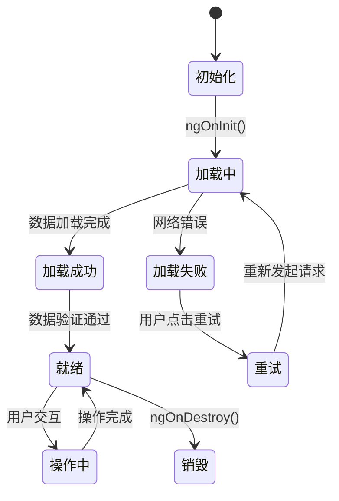
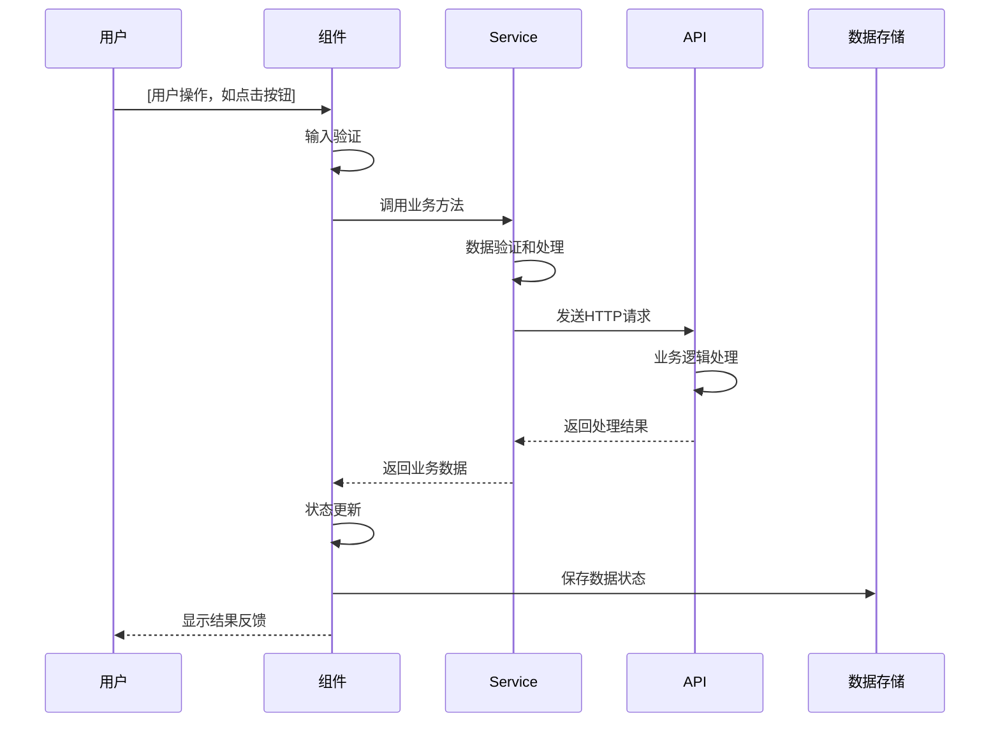
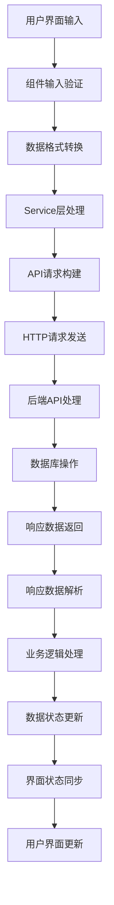
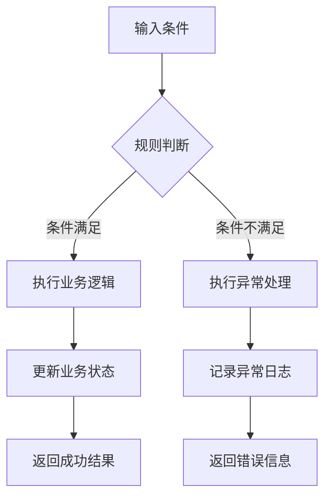
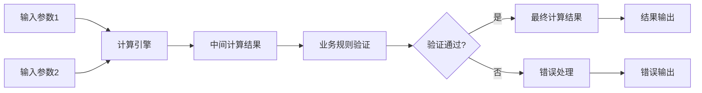
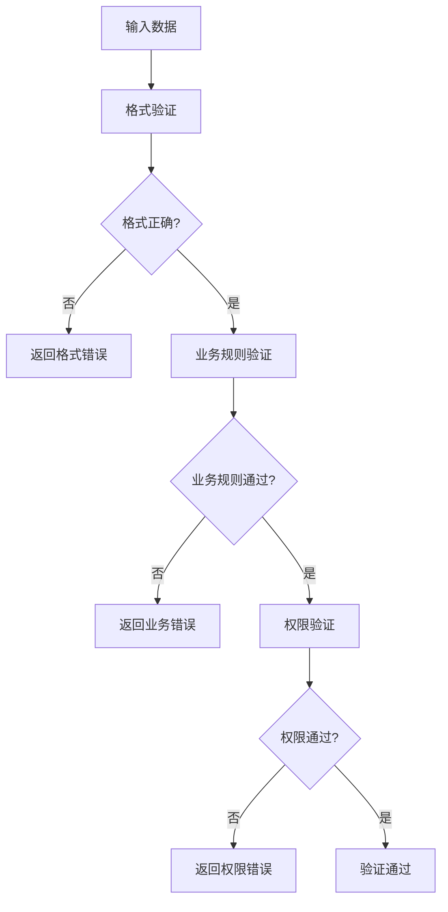
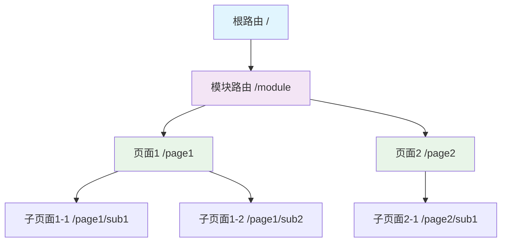
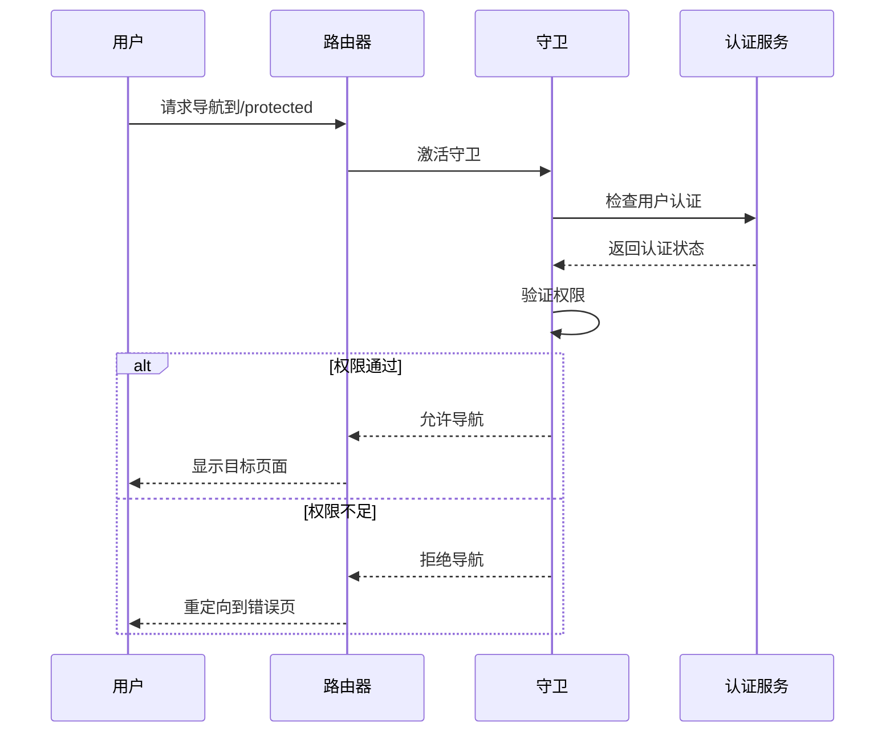

# Application Flows Refactoring Specification

**项目名称**: [项目名称]  
**重构目标**: Angular → React + TypeScript  
**源系统路径**: [源代码路径]  
**提取日期**: [日期]  
**分析范围**: [重构涉及的模块/功能范围]

---

## Phase 2: Application Flows Analysis - User Journey Mapping

### 🔴 Constitution VI-F Compliance: Route Preservation
**MANDATORY**: All frontend routes, navigation patterns, and user flows must be preserved exactly from the Angular implementation.

## 1. 用户旅程流程分析 (User Journey Flows Analysis)

### 1.1 主要用户旅程 (Primary User Journeys)

#### 旅程: [旅程名称]
**业务重要性**: [高/中/低]  
**重构影响**: [关键/一般/无影响]  
**源位置**: [file_path]:[line_number]

**用户旅程描述**:
用户从进入系统到完成目标的完整操作流程，包括所有关键步骤、决策点和系统响应。

**流程步骤分解**:

```mermaid
journey
    title [旅程名称] 用户旅程
    section 步骤1: [步骤描述]
      [用户操作]: [操作描述]
      [系统响应]: [响应描述]
    section 步骤2: [步骤描述]
      [用户操作]: [操作描述] 
      [系统响应]: [响应描述]
    section 步骤3: [步骤描述]
      [用户操作]: [操作描述]
      [系统响应]: [响应描述]
```

**详细步骤说明**:

1. **步骤1**: [步骤描述]
   - **触发条件**: 用户[具体操作]或系统[自动触发]
   - **用户操作**: [详细的用户交互描述]
   - **系统响应**: [系统给出的反馈和状态变化]
   - **数据变化**: [数据状态的变化和流转]
   - **业务验证**: [需要满足的业务规则]

2. **步骤2**: [步骤描述]
   - **触发条件**: 基于步骤1的结果或用户主动操作
   - **用户操作**: [详细的用户交互描述]
   - **系统响应**: [系统给出的反馈和状态变化]
   - **数据变化**: [数据状态的变化和流转]
   - **业务验证**: [需要满足的业务规则]

3. **步骤3**: [步骤描述]
   - **触发条件**: 基于前面步骤的结果或用户主动操作
   - **用户操作**: [详细的用户交互描述]
   - **系统响应**: [系统给出的反馈和状态变化]
   - **数据变化**: [数据状态的变化和流转]
   - **业务验证**: [需要满足的业务规则]

**业务规则约束**:

| 规则ID | 规则描述 | 应用步骤 | 重构要求 |
|--------|----------|----------|----------|
| BR-001 | [业务规则描述] | 步骤1,2 | 必须保持 |
| BR-002 | [业务规则描述] | 步骤2,3 | 必须保持 |
| BR-003 | [业务规则描述] | 全流程 | 必须保持 |

**异常处理机制**:

| 异常类型 | 触发条件 | 处理方式 | 用户体验 | 重构要求 |
|----------|----------|----------|----------|----------|
| 网络异常 | 网络连接失败 | 重试机制 | 显示重试按钮 | 保持一致 |
| 权限异常 | 用户无权限 | 跳转登录 | 保存当前状态 | 保持一致 |
| 数据异常 | 数据格式错误 | 错误提示 | 友好错误信息 | 保持一致 |

### 1.2 关键流程映射表

| 流程ID | 流程名称 | 源文件位置 | 业务重要性 | 重构约束 | 验证方法 |
|--------|----------|------------|------------|----------|----------|
| FLOW-001 | [流程名] | [file_path]:[line_number] | P0/P1/P2 | 必须保持 | 端到端测试 |
| FLOW-002 | [流程名] | [file_path]:[line_number] | P0/P1/P2 | 必须保持 | 用户验收 |

---

## 2. 组件交互流程分析 (Component Interaction Flows)

### 2.1 组件状态管理流程

#### 组件/页面: [ComponentName]
**源位置**: [file_path]:[line_number]  
**组件类型**: [页面/组件/服务]  
**重构要求**: [完全保持/可优化]

**状态机流程图**:



**状态转换说明**:

| 当前状态 | 触发事件 | 目标状态 | 数据变化 | 用户影响 |
|----------|----------|----------|----------|----------|
| 初始化 | 组件创建 | 加载中 | 设置loading标志 | 显示loading动画 |
| 加载中 | 数据返回 | 加载成功 | 存储API数据 | 显示内容 |
| 加载中 | 网络错误 | 加载失败 | 存储错误信息 | 显示错误提示 |
| 加载失败 | 用户重试 | 加载中 | 清除错误状态 | 重新加载 |
| 加载成功 | 数据验证 | 就绪 | 激活交互 | 允许用户操作 |
| 就绪 | 用户操作 | 操作中 | 更新操作状态 | 显示处理中 |
| 操作中 | 操作完成 | 就绪 | 保存操作结果 | 恢复交互状态 |

**状态管理规则**:
- 所有状态转换必须通过明确的事件触发
- 状态转换必须有对应的用户反馈
- 错误状态必须提供恢复机制
- 异步操作必须显示loading状态

### 2.2 用户交互事件分析

#### 交互模式: [交互模式名称]
**源位置**: [file_path]:[line_number]  
**事件类型**: [click/change/input/custom]  
**业务影响**: [高/中/低]

**交互流程序列图**:



**交互处理流程**:

1. **事件捕获**: 用户操作被组件正确捕获
   - 触发条件: [具体触发条件描述]
   - 数据验证: [输入验证规则]
   - 权限检查: [权限验证逻辑]

2. **业务处理**: 调用相应的业务逻辑
   - 服务调用: [调用的服务方法]
   - 数据转换: [数据格式转换]
   - 状态管理: [状态更新逻辑]

3. **API交互**: 与后端进行数据交互
   - HTTP请求: [请求方法和路径]
   - 参数传递: [请求参数格式]
   - 响应处理: [响应数据解析]

4. **界面更新**: 更新用户界面显示
   - 状态变化: [界面状态更新]
   - 数据显示: [数据展示方式]
   - 用户反馈: [操作结果提示]

**交互约束要求**:

| 约束类型 | 要求描述 | 重构级别 | 验证方法 |
|----------|----------|----------|----------|
| 事件触发 | 必须保持完全一致的触发条件 | P0 | 单元测试 |
| 处理顺序 | 步骤顺序不能改变 | P0 | 集成测试 |
| 数据验证 | 验证规则必须保持 | P0 | 业务测试 |
| 错误处理 | 错误处理逻辑必须保持 | P1 | 异常测试 |
| UI反馈 | 用户体验可以优化 | P2 | 用户验收 |

### 2.3 数据流转映射

#### 数据流: [数据流名称]
**数据源**: [数据来源位置]  
**数据目标**: [数据使用位置]  
**触发条件**: [何时触发数据流转]

**数据流程图**:



**数据转换说明**:

| 转换阶段 | 输入数据 | 输出数据 | 转换逻辑 | 重构要求 |
|----------|----------|----------|----------|----------|
| 输入验证 | 原始输入 | 验证后数据 | 格式和有效性检查 | 必须保持 |
| 格式转换 | 验证数据 | 标准格式 | 数据类型转换 | 必须保持 |
| 业务处理 | 标准数据 | 业务数据 | 业务规则应用 | 必须保持 |
| API请求 | 业务数据 | 请求格式 | 序列化为请求格式 | 必须保持 |
| 响应解析 | API响应 | 响应数据 | 反序列化处理 | 必须保持 |
| 状态更新 | 响应数据 | 组件状态 | 状态管理更新 | 必须保持 |

---

## 3. 业务逻辑映射

### 3.1 核心业务规则分析

#### 规则: [业务规则名称]
**业务重要性**: [高/中/低]  
**应用范围**: [具体应用场景]  
**源位置**: [file_path]:[line_number]

**规则描述**:
详细描述业务规则的具体内容、应用条件和预期效果。

**业务规则流程图**:



**规则实现要求**:

| 要求项 | 具体描述 | 重构级别 | 验证方法 |
|--------|----------|----------|----------|
| 规则逻辑 | 业务判断逻辑必须完全保持 | P0 | 业务测试 |
| 数据输入 | 输入数据格式必须保持 | P0 | 接口测试 |
| 输出结果 | 输出结果格式必须保持 | P0 | 结果验证 |
| 异常处理 | 异常情况处理必须保持 | P1 | 异常测试 |
| 性能要求 | 处理时间不超过原系统 | P2 | 性能测试 |

### 3.2 计算逻辑映射

#### 计算: [计算名称]
**计算用途**: [计算的业务目的]  
**源位置**: [file_path]:[line_number]  
**重构要求**: [必须保持/可优化]

**计算流程图**:



**计算参数映射**:

| 参数名称 | 数据类型 | 取值范围 | 默认值 | 重构要求 |
|----------|----------|----------|--------|----------|
| [param1] | [type] | [range] | [default] | 必须保持 |
| [param2] | [type] | [range] | [default] | 必须保持 |

**输出结果映射**:

| 结果字段 | 数据类型 | 计算方式 | 精度要求 | 重构要求 |
|----------|----------|----------|----------|----------|
| [result1] | [type] | [method] | [precision] | 必须保持 |
| [result2] | [type] | [method] | [precision] | 必须保持 |

### 3.3 数据验证规则

#### 验证: [验证名称]
**验证目的**: [验证的业务目的]  
**触发时机**: [何时触发验证]  
**源位置**: [file_path]:[line_number]

**验证规则流程**:



**验证规则详细说明**:

| 验证步骤 | 验证内容 | 验证方法 | 错误代码 | 重构要求 |
|----------|----------|----------|----------|----------|
| 步骤1: 格式验证 | 数据格式和类型 | 正则表达式/类型检查 | ERR_INVALID_FORMAT | 必须保持 |
| 步骤2: 业务验证 | 业务规则符合性 | 业务逻辑检查 | ERR_BUSINESS_RULE | 必须保持 |
| 步骤3: 权限验证 | 用户操作权限 | 权限系统检查 | ERR_PERMISSION_DENIED | 必须保持 |

---

## 4. 页面导航与路由结构

### 4.1 路由配置分析

#### 路由模块: [路由模块名称]
**源位置**: [file_path]:[line_number]  
**重构要求**: [必须保持/可优化]

**路由结构图**:



**路由配置映射表**:

| 路由路径 | 组件名称 | 路由参数 | 权限要求 | 重构要求 |
|----------|----------|----------|----------|----------|
| /path1 | Component1 | 无 | 登录用户 | 必须保持 |
| /path2/:id | Component2 | id参数 | 管理员 | 必须保持 |
| /path3/:id/sub | Component3 | id,sub参数 | 特定权限 | 必须保持 |

### 4.2 导航守卫和拦截

#### 守卫: [守卫名称]
**守卫类型**: [CanActivate/CanDeactivate/Resolve]  
**源位置**: [file_path]:[line_number]

**守卫流程图**:



---

## 5. 重构合规性要求与验证

### 5.1 Constitution VI-F 合规性要求

#### 🔴 Route Preservation Mandate
**DIRECTIVE**: All frontend routes, navigation patterns, and user flows must be preserved exactly from the Angular implementation.

**合规性检查清单**:

| 检查项 | 要求描述 | 合规级别 | 验证方法 |
|--------|----------|----------|----------|
| 路由配置 | URL路径结构完全保持 | P0 | 路由对比测试 |
| 参数传递 | 路由参数格式和传递方式 | P0 | 参数传递测试 |
| 导航守卫 | 权限检查逻辑完全保持 | P0 | 权限验证测试 |
| 组件映射 | 路由到组件的映射关系 | P0 | 组件渲染测试 |
| 状态管理 | 导航状态管理保持 | P1 | 状态同步测试 |

### 5.2 业务流程保持要求

#### ✅ 必须保持的方面
- **100%业务逻辑保持**: 所有业务规则、计算逻辑、验证规则必须完全保持
- **用户流程不变**: 用户操作流程、步骤顺序、决策点必须保持一致
- **数据流保持**: 数据在系统中的流转路径、转换逻辑必须保持一致
- **错误处理保持**: 异常处理机制、错误提示、恢复流程必须保持
- **性能特性**: 响应时间、并发处理、资源使用不得劣于原系统

#### ✅ 允许优化的方面
- **UI/UX优化**: 界面布局、视觉设计、交互体验可以基于新技术栈优化
- **性能优化**: 加载速度、响应性能、内存使用可以优化但不能劣化
- **代码质量**: TypeScript类型安全、代码结构、可维护性可以改进
- **开发体验**: 调试工具、开发环境、构建流程可以优化

#### ❌ 严格禁止的变更
- **业务逻辑修改**: 严禁修改任何业务规则或计算逻辑
- **数据结构调整**: 严禁修改数据模型结构或字段含义
- **API调用变更**: 严禁修改API调用方式或参数格式
- **用户流程变更**: 严禁改变用户操作流程或步骤顺序
- **路由结构变更**: 严禁修改URL结构或导航流程

### 5.3 验证方法与标准

#### 验证矩阵表

| 验证类型 | 验证内容 | 验证方法 | 预期结果 | 优先级 |
|----------|----------|----------|----------|--------|
| 功能验证 | 业务功能完整性 | 端到端测试 | 100%功能一致 | P0 |
| 流程验证 | 用户流程正确性 | 用户验收测试 | 用户无感知差异 | P0 |
| 数据验证 | 数据流转准确性 | 数据对比测试 | 数据完全一致 | P1 |
| 性能验证 | 性能不劣化 | 性能基准测试 | 性能≥原系统 | P1 |
| 兼容验证 | 浏览器兼容性 | 兼容性测试 | 支持相同浏览器 | P2 |

### 5.4 质量保证流程

#### Phase 1: 基线验证
- [ ] **流程文档化**: 所有用户流程已完整文档化
- [ ] **规则映射**: 业务规则已完整映射到新实现
- [ ] **数据流定义**: 数据流转路径已清晰定义
- [ ] **验收标准**: 验收标准和测试用例已明确

#### Phase 2: 实现验证  
- [ ] **逻辑一致性**: 新实现业务逻辑100%一致
- [ ] **流程保持**: 用户操作流程完全保持
- [ ] **数据同步**: 数据流转路径和状态同步保持
- [ ] **错误处理**: 错误处理行为和用户反馈一致

#### Phase 3: 用户验收
- [ ] **无感知迁移**: 用户操作无感知差异
- [ ] **结果一致性**: 业务结果完全一致
- [ ] **性能保证**: 性能不劣于原系统
- [ ] **UX体验**: UX体验符合预期且有所提升

---

## 6. 技术实现映射

### 6.1 Angular 到 React 技术映射

| Angular概念 | React对应实现 | 迁移要求 | 验证方法 |
|-------------|---------------|----------|----------|
| 组件 | React函数组件 + Hooks | 功能对等 | 组件测试 |
| 服务 | 自定义Hooks + 工具函数 | 行为一致 | 服务测试 |
| 依赖注入 | React Context + Props | 逻辑等价 | 集成测试 |
| 路由 | React Router | 路由保持 | 路由测试 |
| 状态管理 | Zustand/Jotai | 状态同步 | 状态测试 |
| HttpClient | fetch/axios | 请求一致 | API测试 |
| RxJS | Promise/自定义Observable | 异步等价 | 异步测试 |
| 模板 | JSX + CSS-in-JS | 视觉一致 | 视觉测试 |

### 6.2 开发工具链映射

| Angular工具 | React工具链 | 迁移要求 |
|-------------|-------------|----------|
| Angular CLI | Vite + React Scripts | 构建等价 |
| Jasmine/Karma | Jest + React Testing Library | 测试覆盖 |
| RxJS Marbles | Jest Mock Functions | 异步测试 |
| Angular DevTools | React DevTools | 调试能力 |

---

**文档状态**: [草稿/完成/已验证]  
**最后更新**: [更新日期]  
**更新人**: [更新者]  

---

*本文档与repositories.md和restful-apis.md共同构成重构的完整契约文档*  
*⚠️ Constitution VI-F Compliance: Any deviation from route preservation or business flow requirements constitutes a violation of the Direct Replacement Principle*