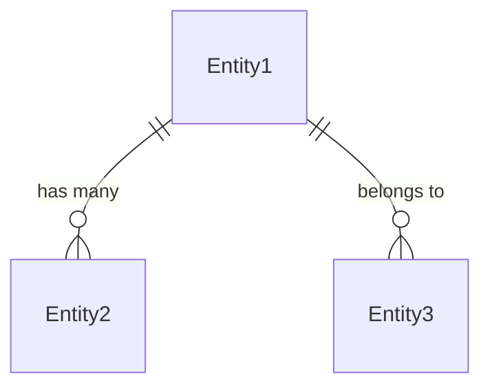
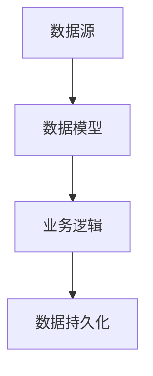

# 数据模型重构文档 (Data Models Refactoring)

**项目名称**: [项目名称]  
**重构目标**: [重构目标]  
**源系统路径**: [源代码路径]  
**提取日期**: [日期]  
**分析范围**: [重构涉及的数据模型范围]

---

## 1. 源系统数据模型提取 (Current System Data Models)

### 1.1 业务实体映射

#### 实体: [EntityName]
**源定义位置**: [file_path]:[line_number]  
**变更频率**: [高/中/低]  
**数据敏感度**: [高/中/低]  
**重构影响**: [关键/一般/无影响]  
**宪法符合性**: [VI-D. Interface and Model Integrity Principle]

**源系统中的实际定义**:
```typescript
// 源代码中的实际接口/类定义 - 严禁自定义修改
// Constitution VI-D: 严禁自定义接口和数据模型，必须从源代码提取
interface [EntityName] {
  [field_name]: [field_type];  // [业务含义 + 约束条件]
  [field_name]: [field_type];  // [业务含义 + 约束条件]
  // ... 其他字段
}
```

**数据真实性要求**:
- [x] **Constitution VI-C**: 严禁使用假数据，必须使用真实的API和数据源
- [x] **Constitution VI-D**: 严禁自定义接口定义，必须从源代码提取
- [x] **Constitution III**: 数据契约完整性必须保持

**数据使用分析**:
- **创建场景**: [在哪些业务流程中被创建]
- **读取场景**: [被哪些组件/服务读取]  
- **更新场景**: [在哪些情况下被更新]
- **删除场景**: [删除的条件和限制]

**关系映射**:
- **一对多**: [关系描述] (关联实体: [RelatedEntity])
- **多对一**: [关系描述] (关联实体: [RelatedEntity])
- **多对多**: [关系描述] (关联实体: [RelatedEntity])

### 1.2 数据模型关键指标

| 实体名称 | 源文件位置 | 字段数量 | 关系复杂度 | 重构约束 | 验证优先级 |
|----------|------------|----------|------------|----------|------------|
| [Entity1] | [file_path]:[line_number] | [count] | [高/中/低] | [保持/优化] | P0/P1/P2 |
| [Entity2] | [file_path]:[line_number] | [count] | [高/中/低] | [保持/优化] | P0/P1/P2 |

---

## 2. 数据模型关系图

### 2.1 实体关系图


### 2.2 数据流图


---

## 3. 数据访问层

### 3.1 Repository接口
```typescript
interface [EntityName]Repository {
  findById(id: string): Promise<[EntityName]>;
  findAll(params: QueryParams): Promise<[EntityName][]>;
  create(data: CreateDto): Promise<[EntityName]>;
  update(id: string, data: UpdateDto): Promise<[EntityName]>;
  delete(id: string): Promise<void>;
}
```

### 3.2 数据验证规则
- **必填字段**: [字段列表]
- **格式验证**: [验证规则]
- **业务规则**: [业务约束]

---

## 4. API数据传输对象

### 4.1 DTO定义
```typescript
// 请求DTO
export class Create[EntityName]Dto {
  @ApiProperty()
  name: string;
  
  @ApiPropertyOptional()
  description?: string;
}

// 响应DTO  
export class [EntityName]Dto {
  @ApiProperty()
  id: string;
  
  @ApiProperty()
  name: string;
}
```

### 4.2 数据转换规则
- **Entity → DTO**: [转换规则]
- **DTO → Entity**: [转换规则]
- **验证约束**: [约束条件]

---

## 5. 状态管理

### 5.1 实体状态
```typescript
enum [EntityName]Status {
  ACTIVE = 'active',
  INACTIVE = 'inactive', 
  DELETED = 'deleted'
}
```

### 5.2 状态转换规则
- **初始状态**: [状态说明]
- **允许转换**: [转换规则]
- **转换条件**: [条件说明]

---

## 6. 数据迁移和兼容性

### 6.1 版本兼容性
- **当前版本**: v1.0.0
- **向后兼容**: [兼容性说明]
- **弃用计划**: [时间表]

### 6.2 数据迁移策略
- **迁移类型**: [类型说明]
- **数据映射**: [映射规则]
- **回滚方案**: [回滚策略]

---

## 7. 性能和优化

### 7.1 索引策略
- **主键索引**: [索引配置]
- **外键索引**: [索引配置]
- **复合索引**: [索引配置]

### 7.2 查询优化
- **缓存策略**: [缓存配置]
- **分页配置**: [分页参数]
- **查询优化**: [优化建议]

---

*此文档基于源代码分析生成，确保重构过程中的数据模型一致性*