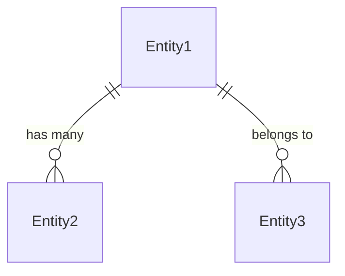
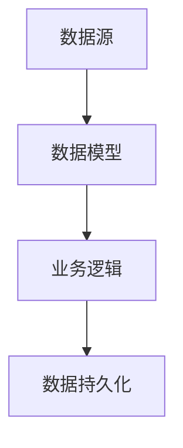

# 数据模型重构文档 (Data Models Refactoring)

**项目名称**: [项目名称]  
**重构目标**: [重构目标]  
**源系统路径**: [源代码路径]  
**提取日期**: [日期]  
**分析范围**: [重构涉及的数据模型范围]

---

## 1. 源系统数据模型提取 (Current System Data Models)

### 1.1 业务实体映射

#### 实体: [EntityName]
**源定义位置**: [file_path]:[line_number]  
**变更频率**: [高/中/低]  
**数据敏感度**: [高/中/低]  
**重构影响**: [关键/一般/无影响]  
**宪法符合性**: [VI-D. Interface and Model Integrity Principle]

**源系统中的实际定义**:
```typescript
// 源代码中的实际接口/类定义 - 严禁自定义修改
// Constitution VI-D: 严禁自定义接口和数据模型，必须从源代码提取
interface [EntityName] {
  [field_name]: [field_type];  // [业务含义 + 约束条件]
  [field_name]: [field_type];  // [业务含义 + 约束条件]
  // ... 其他字段
}
```

**数据真实性要求**:
- [x] **Constitution VI-C**: 严禁使用假数据，必须使用真实的API和数据源
- [x] **Constitution VI-D**: 严禁自定义接口定义，必须从源代码提取
- [x] **Constitution III**: 数据契约完整性必须保持

**数据使用分析**:
- **创建场景**: [在哪些业务流程中被创建]
- **读取场景**: [被哪些组件/服务读取]  
- **更新场景**: [在哪些情况下被更新]
- **删除场景**: [删除的条件和限制]

**关系映射**:
- **一对多**: [关系描述] (关联实体: [RelatedEntity])
- **多对一**: [关系描述] (关联实体: [RelatedEntity])
- **多对多**: [关系描述] (关联实体: [RelatedEntity])

### 1.2 数据模型关键指标

| 实体名称 | 源文件位置 | 字段数量 | 关系复杂度 | 重构约束 | 验证优先级 |
|----------|------------|----------|------------|----------|------------|
| [Entity1] | [file_path]:[line_number] | [count] | [高/中/低] | [保持/优化] | P0/P1/P2 |
| [Entity2] | [file_path]:[line_number] | [count] | [高/中/低] | [保持/优化] | P0/P1/P2 |

---

## 2. 数据模型关系图

### 2.1 实体关系图

```mermaid
erDiagram
    Entity1 ||--o{ Entity2 : "has many"
    Entity1 ||--o{ Entity3 : "belongs to"
```

### 2.2 数据流图

```mermaid
graph TD
    A[数据源] --> B[数据模型]
    B --> C[业务逻辑]
    C --> D[数据持久化]
```

---

## 3. 数据访问层 (Repository层精准还原)

### 3.1 Repository接口精准还原 (NON-NEGOTIABLE)

**宪法原则**: VI-G. Repository Layer Integrity Principle

**源系统Repository接口**:
```typescript
// 源代码中的实际Repository接口定义 - 严禁自定义修改
// Constitution VI-G: Repository层必须100%精准还原
interface [EntityName]Repository {
  // 基础CRUD操作 - 必须完全保持源系统定义
  findById(id: string): Promise<[EntityName]>;
  findAll(params: QueryParams): Promise<[EntityName][]>;
  create(data: CreateDto): Promise<[EntityName]>;
  update(id: string, data: UpdateDto): Promise<[EntityName]>;
  delete(id: string): Promise<void>;
  
  // 源系统特有方法 - 必须完全保持
  [source_specific_method]: [return_type];
  // ... 其他源系统特有方法
}
```

**Repository层精准还原要求**:
- [x] **接口定义100%保持**: 方法签名、参数类型、返回类型必须完全一致
- [x] **异步模式保持**: Promise/async/await模式必须保持一致
- [x] **错误处理机制**: 异常类型、错误消息、错误传播必须完全相同
- [x] **查询语义保持**: 查询逻辑、过滤条件、排序规则必须保持不变
- [x] **事务边界保持**: 事务开始、提交、回滚时机必须完全保持
- [x] **缓存策略保持**: 缓存机制、失效策略、缓存键生成必须保持一致

### 3.2 数据访问行为契约 (Behavioral Contract)

**查询行为必须保持**:
- **查询语义**: 相同的查询条件必须产生完全相同的结果集
- **排序规则**: 排序字段、排序方向必须保持一致
- **分页行为**: 分页参数、页码计算、总数统计必须保持一致
- **过滤条件**: 过滤逻辑、条件组合、空值处理必须保持不变

**事务行为必须保持**:
- **事务边界**: 事务开始和结束的时机必须完全保持
- **隔离级别**: 数据库事务隔离级别必须保持一致
- **回滚条件**: 触发回滚的条件和时机必须保持一致
- **嵌套事务**: 嵌套事务的处理方式必须保持一致

**性能特征必须匹配**:
- **响应时间**: 查询响应时间必须在可接受范围内（±10%）
- **资源使用**: 内存使用、连接池使用必须保持原有模式
- **并发性能**: 并发访问性能必须保持一致
- **缓存命中**: 缓存命中率和缓存策略必须保持一致

### 3.3 Repository层验证标准

**功能一致性验证**:
- **输入输出验证**: 相同输入必须产生完全相同的输出
- **错误处理验证**: 相同错误条件必须产生相同的错误响应
- **边界条件验证**: 边界条件处理必须保持一致
- **并发访问验证**: 并发场景下的数据一致性必须保持

**数据完整性验证**:
- **原子性验证**: 数据操作必须保持原子性
- **一致性验证**: 数据状态转换必须保持一致性
- **隔离性验证**: 并发操作间的隔离性必须保持
- **持久性验证**: 数据持久化行为必须保持一致

**性能基准验证**:
- **查询性能**: 关键查询的性能必须在基准范围内
- **内存使用**: 内存使用模式必须保持一致
- **连接管理**: 数据库连接管理必须保持原有模式
- **缓存效果**: 缓存策略的效果必须保持一致

### 3.4 前端项目的Repository层特殊要求

**API调用模式必须保持**:
- **HTTP方法**: GET/POST/PUT/DELETE等HTTP方法必须完全保持
- **URL路径**: API端点路径必须完全保持
- **请求头**: Content-Type、Authorization等请求头必须保持一致
- **查询参数**: URL查询参数的名称和值必须保持一致

**数据加载策略必须保持**:
- **懒加载**: 按需加载数据的策略必须保持一致
- **预加载**: 预先加载数据的策略必须保持一致
- **分页加载**: 分页加载数据的策略必须保持一致
- **批量加载**: 批量加载数据的策略必须保持一致

**状态管理模式必须保持**:
- **数据状态**: 数据的状态管理模式必须保持一致
- **更新机制**: 数据更新机制和响应式行为必须保持
- **缓存策略**: 客户端缓存策略必须保持一致
- **同步机制**: 数据同步机制必须保持一致

### 3.5 数据验证规则

**必填字段验证**:
- [x] **源系统验证规则**: 必须完全保持源系统的验证逻辑
- [x] **验证时机**: 验证的执行时机必须保持一致
- [x] **验证错误**: 验证错误的类型和消息必须保持一致

**格式验证**:
- [x] **格式规则**: 数据格式验证规则必须保持不变
- [x] **正则表达式**: 正则表达式验证必须保持一致
- [x] **自定义验证**: 自定义验证逻辑必须完全保持

**业务规则验证**:
- [x] **业务约束**: 业务约束条件必须保持一致
- [x] **关联验证**: 关联数据的验证逻辑必须保持
- [x] **权限验证**: 权限相关的验证逻辑必须保持

---

## 4. API数据传输对象

### 4.1 DTO定义
```typescript
// 请求DTO
export class Create[EntityName]Dto {
  @ApiProperty()
  name: string;
  
  @ApiPropertyOptional()
  description?: string;
}

// 响应DTO  
export class [EntityName]Dto {
  @ApiProperty()
  id: string;
  
  @ApiProperty()
  name: string;
}
```

### 4.2 数据转换规则
- **Entity → DTO**: [转换规则]
- **DTO → Entity**: [转换规则]
- **验证约束**: [约束条件]

---

## 5. 状态管理

### 5.1 实体状态
```typescript
enum [EntityName]Status {
  ACTIVE = 'active',
  INACTIVE = 'inactive', 
  DELETED = 'deleted'
}
```

### 5.2 状态转换规则
- **初始状态**: [状态说明]
- **允许转换**: [转换规则]
- **转换条件**: [条件说明]

---

## 6. 数据迁移和兼容性

### 6.1 版本兼容性
- **当前版本**: v1.0.0
- **向后兼容**: [兼容性说明]
- **弃用计划**: [时间表]

### 6.2 数据迁移策略
- **迁移类型**: [类型说明]
- **数据映射**: [映射规则]
- **回滚方案**: [回滚策略]

---

## 7. 性能和优化

### 7.1 索引策略
- **主键索引**: [索引配置]
- **外键索引**: [索引配置]
- **复合索引**: [索引配置]

### 7.2 查询优化
- **缓存策略**: [缓存配置]
- **分页配置**: [分页参数]
- **查询优化**: [优化建议]

---

*此文档基于源代码分析生成，确保重构过程中的数据模型一致性*