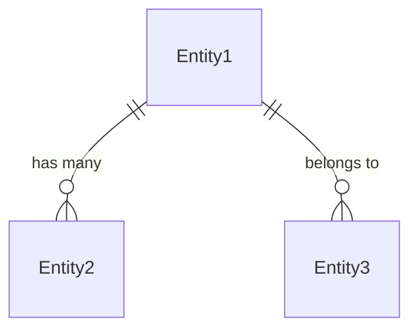
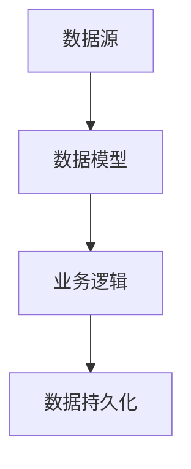

# 数据模型文档 (Data Models)

**项目名称**: [项目名称]  
**重构目标**: [重构目标]  
**创建日期**: [日期]  
**源路径**: [源代码路径]

---

## 1. 核心数据模型

### 1.1 主要实体定义

#### [实体名称]
```typescript
interface [EntityName] {
  // 属性定义
  id: string;                    // 主键标识
  name: string;                   // 显示名称
  // 其他属性...
}
```

**用途**: [实体用途说明]  
**来源**: [源文件位置]  
**关系**: [与其他实体的关系]

---

## 2. 数据模型关系图

### 2.1 实体关系图


### 2.2 数据流图


---

## 3. 数据访问层

### 3.1 Repository接口
```typescript
interface [EntityName]Repository {
  findById(id: string): Promise<[EntityName]>;
  findAll(params: QueryParams): Promise<[EntityName][]>;
  create(data: CreateDto): Promise<[EntityName]>;
  update(id: string, data: UpdateDto): Promise<[EntityName]>;
  delete(id: string): Promise<void>;
}
```

### 3.2 数据验证规则
- **必填字段**: [字段列表]
- **格式验证**: [验证规则]
- **业务规则**: [业务约束]

---

## 4. API数据传输对象

### 4.1 DTO定义
```typescript
// 请求DTO
export class Create[EntityName]Dto {
  @ApiProperty()
  name: string;
  
  @ApiPropertyOptional()
  description?: string;
}

// 响应DTO  
export class [EntityName]Dto {
  @ApiProperty()
  id: string;
  
  @ApiProperty()
  name: string;
}
```

### 4.2 数据转换规则
- **Entity → DTO**: [转换规则]
- **DTO → Entity**: [转换规则]
- **验证约束**: [约束条件]

---

## 5. 状态管理

### 5.1 实体状态
```typescript
enum [EntityName]Status {
  ACTIVE = 'active',
  INACTIVE = 'inactive', 
  DELETED = 'deleted'
}
```

### 5.2 状态转换规则
- **初始状态**: [状态说明]
- **允许转换**: [转换规则]
- **转换条件**: [条件说明]

---

## 6. 数据迁移和兼容性

### 6.1 版本兼容性
- **当前版本**: v1.0.0
- **向后兼容**: [兼容性说明]
- **弃用计划**: [时间表]

### 6.2 数据迁移策略
- **迁移类型**: [类型说明]
- **数据映射**: [映射规则]
- **回滚方案**: [回滚策略]

---

## 7. 性能和优化

### 7.1 索引策略
- **主键索引**: [索引配置]
- **外键索引**: [索引配置]
- **复合索引**: [索引配置]

### 7.2 查询优化
- **缓存策略**: [缓存配置]
- **分页配置**: [分页参数]
- **查询优化**: [优化建议]

---

*此文档基于源代码分析生成，确保重构过程中的数据模型一致性*